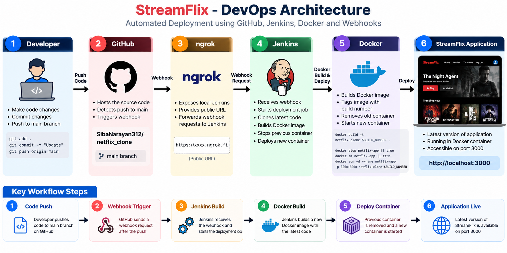

# StreamFlix Full Stack — Automated DevOps Deployment

[](https://nodejs.org/)
[](https://www.docker.com/)
[](https://www.jenkins.io/)
[](https://github.com/)

StreamFlix is a Netflix-inspired full-stack streaming dashboard built with Node.js and vanilla JavaScript. It provides authentication-style flows, catalog search and filtering, watchlist persistence, and continue-watching progress.

The original application has been extended with a local CI/CD-style DevOps workflow. A push to `main` can notify Jenkins through a GitHub webhook; Jenkins then builds a versioned Docker image and replaces the running StreamFlix container.

> This is a local automated build-and-deployment setup, not a cloud or production deployment.

## Contents

- [Features](#features)
- [Tech stack](#tech-stack)
- [Demo login](#demo-login)
- [API endpoints](#api-endpoints)
- [Project structure](#project-structure)
- [Run locally](#run-locally)
- [Docker deployment](#docker-deployment)
- [DevOps implementation](#devops-implementation)
- [How the deployment works](#how-the-deployment-works)
- [DevOps architecture](#devops-architecture)
- [Deployment verification](#deployment-verification)
- [Screenshots](#screenshots)
- [Resume highlights](#resume-highlights)
- [Learning outcomes](#learning-outcomes)
- [Future improvements](#future-improvements)

## Features

### Application

- Responsive streaming dashboard with a featured title, catalog, plan cards, watchlist, and viewing progress
- Node.js REST API built with the native HTTP module
- Login, registration, logout, and token-based authenticated requests
- Catalog search plus genre and type filtering
- Watchlist management and continue-watching progress
- JSON-file persistence in `data/db.json`
- No runtime backend dependencies beyond Node.js

### DevOps

- Dockerized Node.js application exposed on port `3000`
- Jenkins job for automated image build and deployment
- GitHub push webhook integration, exposed to the local Jenkins instance through ngrok
- Build-number Docker tags in the form `netflix-clone:$BUILD_NUMBER`
- Replacement of the previous `netflix-app` container during deployment

## Tech stack

| Area | Technology |
| --- | --- |
| Frontend | HTML, CSS, vanilla JavaScript |
| Backend | Node.js native HTTP module |
| Persistence | JSON (`data/db.json`) |
| Source control | Git and GitHub |
| Containerization | Docker |
| CI/CD-style automation | Jenkins |
| Webhook tunnel | ngrok |

## Demo login

```text
Email: demo@streamflix.com
Password: password123
```

## API endpoints

The server is available at `http://localhost:3000`. Protected endpoints require an `Authorization: Bearer <token>` header returned from login or registration.

| Method | Endpoint | Purpose |
| --- | --- | --- |
| GET | `/api/health` | Health response |
| POST | `/api/auth/login` | Sign in and receive a token |
| POST | `/api/auth/register` | Create an account and receive a token |
| POST | `/api/auth/logout` | End the current session |
| GET | `/api/me` | Get the authenticated user |
| GET | `/api/catalog?search=&genre=&type=` | Browse and filter catalog items |
| GET | `/api/featured` | Get the featured title |
| GET | `/api/genres` | List catalog genres |
| GET | `/api/stats` | Get catalog statistics |
| GET | `/api/watchlist` | Get the authenticated user's watchlist |
| POST | `/api/watchlist/:titleId` | Add a title to the watchlist |
| DELETE | `/api/watchlist/:titleId` | Remove a title from the watchlist |
| POST | `/api/progress/:titleId` | Save viewing progress |

## Project structure

```text
netflix_clone/
├── data/
│   └── db.json                  # Catalog, user, session, and progress data
├── image/
│   └── devops-architecture.png # Deployment architecture diagram
├── public/
│   ├── assets/                  # Local image and SVG assets
│   ├── app.js                   # Client-side application logic
│   ├── index.html
│   └── styles.css
├── .gitignore
├── Dockerfile
├── package.json
├── package-lock.json
├── README.md
└── server.js                    # Static-file server and REST API
```

## Run locally

Prerequisite: Node.js 20 or later is recommended (the Docker image uses Node.js 20).

```bash
npm install
npm start
```

Open [http://localhost:3000](http://localhost:3000).

## Docker deployment

Build and run StreamFlix locally:

```bash
docker build -t netflix-clone:local .
docker run -d --name netflix-app -p 3000:3000 netflix-clone:local
```

Open [http://localhost:3000](http://localhost:3000). To stop and remove this local container:

```bash
docker stop netflix-app
docker rm netflix-app
```

### Dockerfile

The Dockerfile uses the official `node:20` base image, sets `/app` as the working directory, copies the package manifests, runs `npm install`, copies the application source, exposes port `3000`, and starts the application with `npm start`.

## DevOps implementation

StreamFlix was developed as an application project first. The DevOps work builds on that existing application by adding Dockerization, Jenkins automation, GitHub webhook integration, and automated Docker deployment. It does not replace or change the core application features.

The configured Jenkins job (`Netflix-Clone-Deployment`) uses the checked-out repository to:

```bash
echo "Starting Netflix Clone deployment..."

echo "Building Docker image..."
docker build -t netflix-clone:$BUILD_NUMBER .

echo "Removing previous container if it exists..."
docker stop netflix-app || true
docker rm netflix-app || true

echo "Starting new container..."
docker run -d --name netflix-app -p 3000:3000 netflix-clone:$BUILD_NUMBER

echo "Deployment completed successfully!"
```

This job currently builds and deploys the application; it does not run automated tests.

## How the deployment works

```text
Developer
    ↓
git push
    ↓
GitHub (main branch)
    ↓
GitHub Webhook
    ↓
ngrok
    ↓
Jenkins
    ↓
Docker Build
    ↓
New Docker Container
    ↓
StreamFlix on port 3000
```

1. A developer pushes changes to the GitHub repository's `main` branch.
2. GitHub sends a webhook event to the public ngrok URL that forwards to local Jenkins.
3. Jenkins triggers `Netflix-Clone-Deployment` and checks out the repository.
4. Jenkins builds `netflix-clone:$BUILD_NUMBER`.
5. Jenkins stops and removes the existing `netflix-app` container if present.
6. Jenkins starts a new `netflix-app` container mapped from host port `3000` to container port `3000`.

## DevOps architecture



The architecture image illustrates the GitHub → webhook → ngrok → Jenkins → Docker path used to publish the latest local container.

## Deployment verification

After a successful Jenkins build, verify the deployment with:

```bash
docker ps --filter "name=netflix-app"
docker images netflix-clone
curl http://localhost:3000/api/health
```

Expected health response:

```json
{"status":"ok","app":"StreamFlix API"}
```

You can also open [http://localhost:3000](http://localhost:3000) in a browser. The latest verified deployment was image `netflix-clone:5`.

## Screenshots

Screenshots will be added here after capture.

<!-- TODO: Add screenshot — StreamFlix application -->
<!-- TODO: Add screenshot — GitHub repository -->
<!-- TODO: Add screenshot — Docker container -->
<!-- TODO: Add screenshot — Jenkins job configuration -->
<!-- TODO: Add screenshot — Jenkins successful build -->
<!-- TODO: Add screenshot — Jenkins console output -->
<!-- TODO: Add screenshot — GitHub webhook configuration -->
<!-- TODO: Add screenshot — GitHub webhook successful delivery -->
<!-- TODO: Add screenshot — Automated deployment result -->

## Resume highlights

- Built and containerized a full-stack Node.js streaming dashboard.
- Implemented a GitHub webhook–triggered Jenkins deployment workflow for the `main` branch.
- Used Jenkins build numbers to tag Docker images and safely replace the running application container.
- Documented the local CI/CD-style delivery path from source-control push to a live container on port `3000`.

## Learning outcomes

- Containerizing a Node.js application with Docker
- Connecting GitHub events to Jenkins through webhooks and a local tunnel
- Automating build, container replacement, and deployment steps
- Verifying a deployed service with Docker and HTTP health checks

## Future improvements

- Add automated unit and API tests to the Jenkins pipeline
- Add a Jenkinsfile to version pipeline definition alongside the application
- Use `npm ci` in the container build for lockfile-based installs
- Add image scanning, linting, and security checks
- Persist application data outside the container with a managed database or Docker volume
- Deploy to a cloud environment with secrets management, HTTPS, and monitoring
